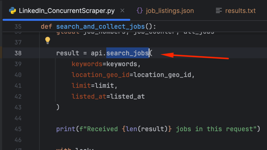
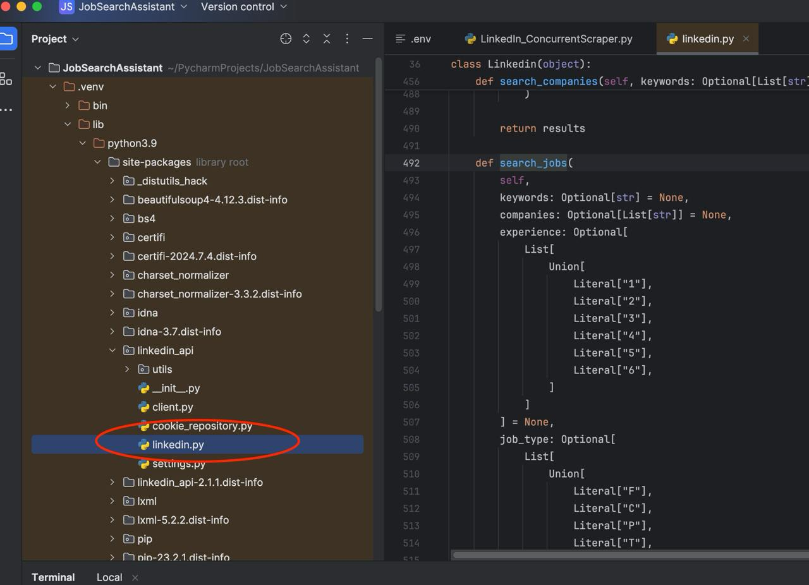
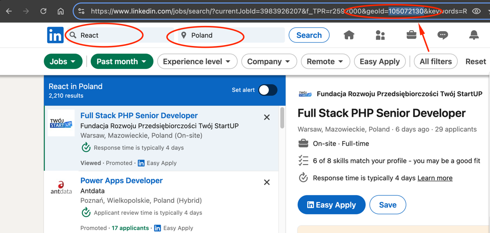
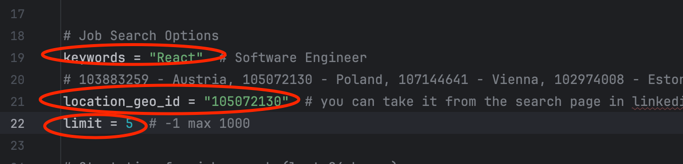
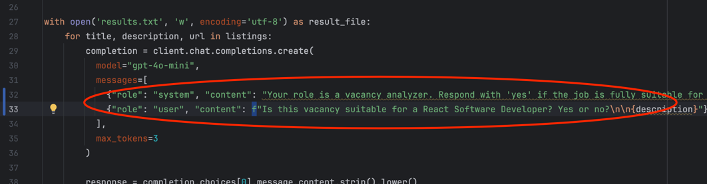

# Preparing:

1. Download this project and open it with [PyCharm](https://www.jetbrains.com/pycharm/). Unpack the project and rename the file `.env_example` to `.env`.
2. Set your LinkedIn Username to `LINKEDIN_USERNAME` and LinkedIn Password to `LINKEDIN_PASSWORD`.
3. Open LinkedIn and upgrade your LinkedIn account to Premium.

	It is not necessary, but in that case, there will be speed and quantity limits on sampling. If not a premium account, reduce the number of working threads to two:
	
	for _ in range(2):
	
	If there are problems, then reduce the scraper limit:
	
	limit = 100
	
	The program uses an unofficial API:
		https://github.com/tomquirk/linkedin-api
		
	If you receive the CHALLENGE error on startup, you need to log out, clear the site's cookies, restart the computer (!), and log in to LinkedIn again. Check the Troubleshooting section in the link above: "I keep getting a CHALLENGE."

4. Top up your [OpenAI account](https://platform.openai.com/) (minimum $5.00).
5. Go to [Dashboard ApiKeys](https://platform.openai.com/api-keys), create a new key, and add it to the `.env` file as the `OPENAI_API_KEY`.

	Alternatively, set the environment variable as described here:
		Step 2: Set up your API key
		https://platform.openai.com/docs/quickstart
		
	Open `OpenAiTest.py` and run the file. You should see a `200 OK` response in the console after a request.

# Installation:

1. Open the Terminal in your IDE and verify the Python installation with `python3 --version` (Linux, macOS) or `python --version` (Windows). If Python is not installed, you need to install Python 3.
2. Install the LinkedIn API library: `pip install git+https://github.com/tomquirk/linkedin-api.git`
3. Install the OpenAI Python library: `pip install --upgrade openai`
4. Install the DotEnv library for managing environment variables: `pip install python-dotenv`

# Patch the LinkedIn API Library to Add Search by Location Ability (geoId):

1. Open the file `LinkedIn_ConcurrentScraper.py` and locate the line with the text `result = api.search_jobs(`.

   

2. Press and hold the `CTRL` key and click on `search_jobs`. This will take you to the file in the library directory:

   

3. In your file manager, replace the file `linkedin.py` with the updated file from this project.

# Tuning:

To find jobs, you need to configure your location, search key, and the number of vacancies (limit) you want to retrieve (maximum 1000 (-1)), as well as set GPT commands.

1. Find the location: Open the LinkedIn search page and perform a search, e.g., `React` `Poland`.

   

2. Set the location you found: Extract the `geoId` number from the URL and set it in `LinkedIn_ConcurrentScraper.py` in the `location_geo_id` field.
	
	**Note:** Some vacancies have the location `European Union`, which might cover your location. By default, the scraper will ignore these vacancies, but you can always redefine the flag `is_EU_vacancies_ignored = True` to `False`, and these vacancies will be included in the result file.  	

3. Set your search key, e.g., `React`, in `LinkedIn_ConcurrentScraper.py` in the `keywords` field.
4. Set your vacancies limit for searching, e.g., 5 (maximum 1000 (-1)).

   

5. Configure GPT commands in the file `OpenAI_JobScreener.py`:

   5.1. System Role command context: Define the context that the system should know before your request. For example: `"Your role is a vacancy analyzer. Respond with 'yes' if the job is fully suitable for a React Developer; otherwise, respond with 'no'."`

   5.2. Request context: This will be sent with each vacancy in the User Role Content. For example: `f"Is this vacancy suitable for a React Software Developer? Yes or no?\n\n{description}"`

   5.3. Do not delete the literal `n` before the User Role Content; it is part of the system command as well.

   

# Running:

1. Open `LinkedIn_ConcurrentScraper.py` and run the script. After execution, you will get a `job_listings.json` file with the results.
2. Open `OpenAI_JobScreener.py` and run the script. After execution, you will get a `results.txt` file with the results. If it is empty, the robot could not select any jobs based on your request. Modify the context requests (5.1, 5.2) if necessary.
3. That's it! You're amazing!